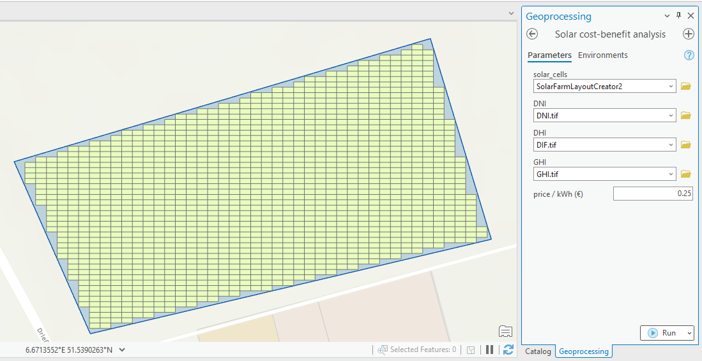
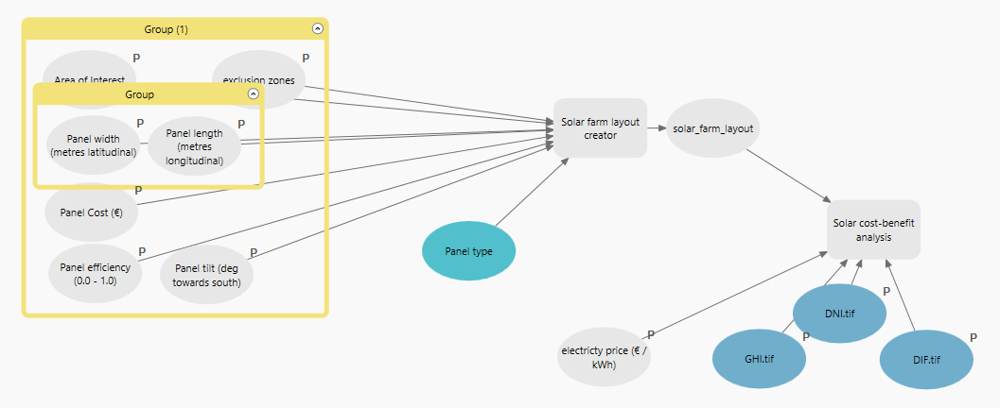

# PIQAA_Solar-farm
PIQAA final project - Group 13 - Ahmed, Almahdi, Niebl

## usage instructions
1. add the toolbox to your arcgis workspace
2. add the irradiance maps (DNI.tif, DIF.tif, GHI.tif) to the arcgis workspace

### solar farm layout tool
input: 
    - Feature layer - area of interest
    - various parameters defining individual solar cells
output: 
    - Feature layer - group of solar cells

1. create your solar farm layout by defining an area of interest.
2. select longitudinal and latitudinal dimension of solar cell (prior to tilt).
3. Area of exclusion is an optional feature layer parameter that can omit solar cells.to be placed within the containing cells. User may draw exclusion zones e.g. around streets or homes.
4. upon execution, solar array is added to the selected output feature layer.
5. some technical details on total cost, area, amount of solar cells are displayed in the toolset log.

Only for use within Germany

### solar cost-benefit analysis tool
input: 
    - Feature layer - group of solar cells
    - Raster data - irradiance maps that are used to derive panel energy output at said location (Solar resource map © 2021 Solargis (CC BY-SA 4.0))
    - electricty price (that is expected as revenue per kWh)
output: 
    - cost of entire solar farm
    - yearly energy output (€/kWh)
    - projected time until cost of solar farm is paid off

1. add the previously created solar panel array as an intput 
2. add the raster layers to the following parameters DNI: "DNI.tif", DHI: "DIF.tif", GHI: "GHI.tif"
3. execute and receive the calculated output from the tools messages.

please note, when using your own irradiance maps, ensure the following format:

#### irradiance maps
Solar irradiance data 
Solar resource map © 2021 Solargis (CC BY-SA 4.0)

The raster files are the daily totals of yearly mean irradiances in kWh/m² across Germany. EPSG:4326

DNI.tif: direct normal irradiance
DIF.tif: diffuce horizontal irradiance (dhi)
GHI.tif: global normal irradiance

### Solar Farm planner model
Combines the two tools into a single pipeline. 
Enter the parameters as you would for the toolsets as previously described.

