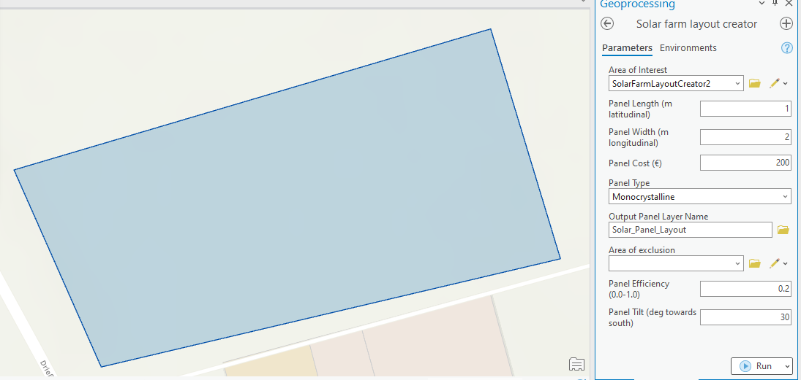

# PIQAA_Solar-farm
PIQAA final project - Group 13 - Ahmed, Almahdi, Niebl

## usage instructions
1. add the toolbox to your arcgis workspace
2. add the irradiance maps (DNI.tif, DIF.tif, GHI.tif) to the arcgis workspace

### solar farm layout tool

1. create your solar farm layout by defining an area of interest
2. select longitudinal and latitudinal dimension of solar cell (prior to tilt)
3. Area of exclusion is an optional feature layer parameter that can omit solar cells to be placed within the containing cells. User may draw exclusion zones e.g. around streets or homes.
4. upon execution, solar array is added to the selected output feature layer
5. some technical details on total cost, area, amount of solar cells are displayed in the toolset log

### solar cost-benefit analysis tool
